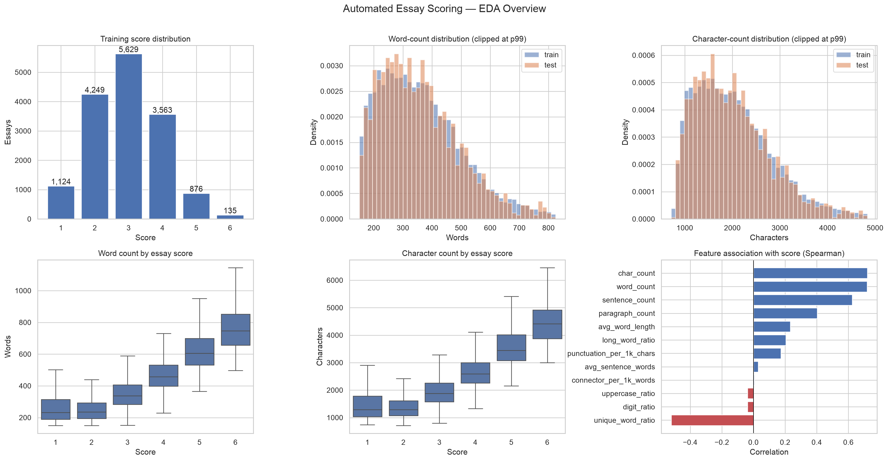

# Exploratory Data Analysis

## Executive summary

- The downloaded split contains **15,576 training essays** and
  **1,731 test essays**.
- All required IDs and texts pass integrity checks. Normalized duplicate checks
  found **0 involved
  train rows**, **0
  involved test rows**, and
  **0 unique cross-split
  matches**.
- Boundary fingerprints generated
  **2 candidate pairs**.
  Full-text similarity confirmed
  **1 within-train** and
  **1 cross-split** pair;
  **1**
  confirmed training pair has conflicting labels. Candidate generation is
  heuristic and does not rule out every possible near duplicate.
- The rarest class is score **6**, with **135 essays
  (0.87%)**. Stratified validation is required.
- The strongest univariate association with score is
  **char_count** (Spearman
  **0.720**).
- Five-fold adversarial validation using numeric style features produced ROC AUC
  **0.505 +/- 0.007**, indicating
  **little detectable drift in the measured style features**.
- The largest train/test standardized mean difference is
  **long_word_ratio=-0.041**.

## Score and feature summary

| score | count | percent | mean_words | median_words | mean_chars | median_sentences | median_paragraphs | mean_unique_word_ratio |
| --- | --- | --- | --- | --- | --- | --- | --- | --- |
| 1 | 1124 | 7.2162 | 265.1619 | 232.0000 | 1510.7616 | 12.0000 | 3.0000 | 0.5370 |
| 2 | 4249 | 27.2791 | 257.9941 | 235.0000 | 1443.2471 | 13.0000 | 3.0000 | 0.5191 |
| 3 | 5629 | 36.1389 | 353.4678 | 338.0000 | 1978.5328 | 19.0000 | 5.0000 | 0.4698 |
| 4 | 3563 | 22.8749 | 474.2492 | 458.0000 | 2683.6966 | 25.0000 | 5.0000 | 0.4344 |
| 5 | 876 | 5.6240 | 626.1461 | 606.0000 | 3607.5856 | 30.0000 | 5.0000 | 0.4057 |
| 6 | 135 | 0.8667 | 765.8519 | 747.0000 | 4490.5926 | 35.0000 | 5.0000 | 0.3901 |

## Train/test feature comparison

| feature | train_mean | test_mean | train_median | test_median | train_p95 | test_p95 | standardized_mean_difference | ks_statistic |
| --- | --- | --- | --- | --- | --- | --- | --- | --- |
| char_count | 2073.4527 | 2055.1011 | 1925.0000 | 1912.0000 | 3722.2500 | 3684.5000 | 0.0202 | 0.0223 |
| word_count | 367.5894 | 364.0751 | 344.0000 | 339.0000 | 651.0000 | 638.5000 | 0.0236 | 0.0259 |
| sentence_count | 19.8650 | 19.7897 | 19.0000 | 18.0000 | 35.0000 | 36.0000 | 0.0084 | 0.0271 |
| paragraph_count | 4.9692 | 4.9295 | 5.0000 | 5.0000 | 9.0000 | 9.0000 | 0.0122 | 0.0079 |
| avg_word_length | 4.4273 | 4.4326 | 4.4269 | 4.4312 | 4.9096 | 4.9034 | -0.0183 | 0.0145 |
| avg_sentence_words | 20.4566 | 20.1947 | 18.4615 | 18.4643 | 32.0000 | 32.3318 | 0.0202 | 0.0097 |
| unique_word_ratio | 0.4757 | 0.4762 | 0.4721 | 0.4724 | 0.6041 | 0.6063 | -0.0065 | 0.0237 |
| long_word_ratio | 0.1844 | 0.1865 | 0.1824 | 0.1846 | 0.2700 | 0.2719 | -0.0411 | 0.0236 |
| punctuation_per_1k_chars | 20.3578 | 20.5313 | 20.0000 | 20.1689 | 31.6690 | 32.3137 | -0.0256 | 0.0215 |
| uppercase_ratio | 0.0236 | 0.0237 | 0.0213 | 0.0213 | 0.0432 | 0.0424 | -0.0045 | 0.0217 |
| digit_ratio | 0.0028 | 0.0028 | 0.0015 | 0.0015 | 0.0102 | 0.0102 | -0.0047 | 0.0106 |
| connector_per_1k_words | 7.4391 | 7.6461 | 6.2112 | 6.6225 | 19.0762 | 19.5759 | -0.0332 | 0.0334 |

## Feature association with score

| feature | spearman_correlation | pvalue |
| --- | --- | --- |
| char_count | 0.7196 | 0.0000 |
| word_count | 0.7177 | 0.0000 |
| sentence_count | 0.6241 | 0.0000 |
| unique_word_ratio | -0.5206 | 0.0000 |
| paragraph_count | 0.4025 | 0.0000 |
| avg_word_length | 0.2336 | 0.0000 |
| long_word_ratio | 0.2049 | 0.0000 |
| punctuation_per_1k_chars | 0.1736 | 0.0000 |
| digit_ratio | -0.0384 | 0.0000 |
| uppercase_ratio | -0.0381 | 0.0000 |
| avg_sentence_words | 0.0297 | 0.0002 |
| connector_per_1k_words | 0.0057 | 0.4753 |

## Score-only stratification feasibility audit

This table only checks whether all classes can be balanced across five folds.
The persisted, near-duplicate-safe split is generated separately by
`python -m src.make_folds` and audited in `validation_report.md`.

| fold | score | count | percent |
| --- | --- | --- | --- |
| 0 | 1 | 225 | 7.2208 |
| 0 | 2 | 850 | 27.2786 |
| 0 | 3 | 1126 | 36.1361 |
| 0 | 4 | 712 | 22.8498 |
| 0 | 5 | 176 | 5.6483 |
| 0 | 6 | 27 | 0.8665 |
| 1 | 1 | 225 | 7.2231 |
| 1 | 2 | 850 | 27.2873 |
| 1 | 3 | 1126 | 36.1477 |
| 1 | 4 | 712 | 22.8571 |
| 1 | 5 | 175 | 5.6180 |
| 1 | 6 | 27 | 0.8668 |
| 2 | 1 | 224 | 7.1910 |
| 2 | 2 | 850 | 27.2873 |
| 2 | 3 | 1126 | 36.1477 |
| 2 | 4 | 713 | 22.8892 |
| 2 | 5 | 175 | 5.6180 |
| 2 | 6 | 27 | 0.8668 |
| 3 | 1 | 225 | 7.2231 |
| 3 | 2 | 849 | 27.2552 |
| 3 | 3 | 1126 | 36.1477 |
| 3 | 4 | 713 | 22.8892 |
| 3 | 5 | 175 | 5.6180 |
| 3 | 6 | 27 | 0.8668 |
| 4 | 1 | 225 | 7.2231 |
| 4 | 2 | 850 | 27.2873 |
| 4 | 3 | 1125 | 36.1156 |
| 4 | 4 | 713 | 22.8892 |
| 4 | 5 | 175 | 5.6180 |
| 4 | 6 | 27 | 0.8668 |

## Modeling implications

1. Use five-fold stratification by score and retain complete out-of-fold
   predictions for QWK evaluation and threshold calibration.
2. Treat this as ordinal regression: train on continuous scores, then map to
   integers 1 through 6 with ordered thresholds.
3. Preserve punctuation, capitalization, spelling, and paragraph breaks because
   they carry scoring information.
4. Include word and character TF-IDF together with basic length/style signals.
5. Report both fixed-threshold and calibrated-threshold QWK so calibration gains
   are not confused with model gains.
6. Fit every vectorizer on the training portion of each fold only; transform the
   validation and test partitions without refitting.
7. Keep confirmed near-duplicate training essays in the same validation fold.
   Retain their supplied labels even when they conflict, and do not copy a
   training label onto a similar test essay.
8. Interpret type-token ratio cautiously because it mechanically decreases with
   essay length and is strongly confounded by length here.

